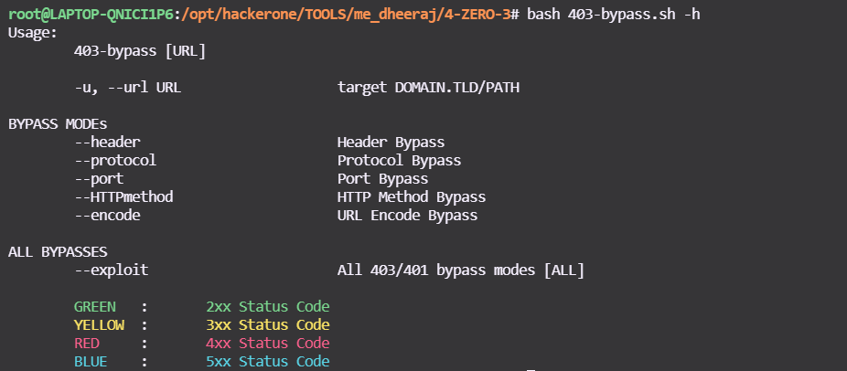

<a href="https://www.buymeacoffee.com/medheeraj"></a>

[](https://opensource.org/licenses/MIT)


### >_ Introduction

**4-ZERO-3**
Tool to bypass 403/401. This script contain all the possible techniques to do the same. 

- **NOTE** : If you see multiple [200 Ok]/bypasses as output, you must check the Content-Length. If the content-length is same for multiple [200 Ok]/bypasses means false positive. Reason can be "301/302" or "../" [Payload] DON'T PANIC.
- Script will print `cURL` PAYLOAD if possible bypass found.

### >_ Preview


### >_ Help
```bash
root@me_dheeraj:$ bash 403-bypass.sh -h
```


### >_ Usage / Modes

- Scan with specific payloads:
  * [ `--header` ] Support HEADER based bypasses/payloads
    ```bash
    root@me_dheeraj:$ bash 403-bypass.sh -u https://target.com/secret --header
    ```
  * [ `--protocol` ] Support PROTOCOL based bypasses/payloads
    ```bash
    root@me_dheeraj:$ bash 403-bypass.sh -u https://target.com/secret --protocol
    ```
  * [ `--port` ] Support PORT based bypasses/payloads
    ```bash
    root@me_dheeraj:$ bash 403-bypass.sh -u https://target.com/secret --port
    ```
  * [ `--HTTPmethod` ] Support HTTP Method based bypasses/payloads
    ```bash
    root@me_dheeraj:$ bash 403-bypass.sh -u https://target.com/secret --HTTPmethod
    ```
  * [ `--encode` ] Support URL Encoded bypasses/payloads
    ```bash
    root@me_dheeraj:$ bash 403-bypass.sh -u https://target.com/secret --encode
    ```
  * [ `--SQLi` ] Support MySQL mod_Security & libinjection bypasses/payloads [** New **]
    ```bash
    root@me_dheeraj:$ bash 403-bypass.sh -u https://target.com/secret --SQLi
    ```
- Complete Scan {includes all exploits/payloads} for an endpoint [ --exploit ]
```bash
root@me_dheeraj:$ bash 403-bypass.sh -u https://target.com/secret --exploit
```

##### Prerequisites
- apt install curl [Debian]

## Support
If you like `4-ZERO-3` and it help you in work, money/bounty, pentesting, recon or just brings you happy feelings, please show your support ! 
:stop_sign:   **Please avoid opening GitHub issues for support requests or questions!**
buy me a beer to keep me powered :)

<a href="https://www.buymeacoffee.com/medheeraj" target="_blank"></a>
